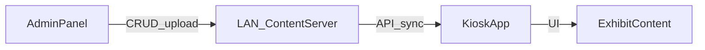

# Техническое задание: информационные киоски

**Версия:** 1.14 (**утверждено**, доп.: регистрация по hostname + активный опрос)  
**Проект:** Stella UDHB — ПО для информационных киосков Windows  
**Дата утверждения:** 2026-07-31  
**Дополнение:** 2026-07-31 — распространение KioskApp через групповые политики / MDM

---

## 1. Цель и назначение

Разработать программный комплекс для информационных киосков на ОС Windows, расположенных рядом с единицами военной техники. Каждый киоск показывает информацию об **одном** экспонате (технике), у которого он установлен. Контент управляется через админ-панель в локальной сети.

---

## 2. Зафиксированные требования

| Область | Решение |
|--------|---------|
| Платформа киоска | **Windows 10/11 Pro** |
| Экран | **Сенсорный**, **1920×1080**, landscape |
| Режим киоска | **Жёсткий kiosk mode** (см. §2.1) |
| Сеть | Локальная сеть (LAN) |
| Управление контентом | Админ-панель (веб) |
| Привязка | Один экспонат на киоск (`kioskId` → `exhibitId`) |
| Типы контента (MVP) | Текст + фото, видео, галерея |
| Игра (`.exe`) | **Вне MVP** — отложено на следующую очередь |
| Мониторинг | **Полный мониторинг состояния киосков** в админке (см. §7.1) |
| Дизайн | Нейтральный «музейный» UI без фирменного гайда; цвета через CSS-переменные для лёгкой перекраски позже |
| Стек KioskApp | **Tauri 2 + React + TypeScript** (см. §3.1) |
| Стек Admin / Server | **React** + **Node.js (TypeScript)** API в LAN (см. §3.1) |
| Масштаб MVP | До **~25 киосков** и **~25 экспонатов** |
| БД | **PostgreSQL** |
| Развёртывание сервера | **Docker Compose** (API + PostgreSQL + раздача админки/файлов) |
| Развёртывание киосков | **Через политики** (GPO / MDM): пакет установщика + конфиг (см. §12.1) |
| Админ-доступ | **Несколько пользователей с ролями** (см. §4) |

### 2.1 Жёсткий kiosk mode (обязательно)

Целевая ОС: **Windows 10 Pro** или **Windows 11 Pro**.

Посетитель не должен иметь доступ к рабочему столу Windows, другим приложениям и системным жестам.

| Требование | Описание |
|------------|----------|
| Оболочка | Киоск работает под выделенной учётной записью Windows в режиме **Assigned Access** (поддержка Pro). KioskApp — нативное окно **Tauri**; настройка Assigned Access / автологин и ограничение оболочки документируются под Win32/MSIX-сценарий на Pro |
| Единственное приложение | В сессии киоска доступен только **KioskApp** (полноэкранно) |
| Блокировка ОС | Недоступны: Win, Alt+Tab, панель задач, проводник, выход в настройки через UI приложения (в рамках политики Assigned Access) |
| Выход техника | Выход из kiosk mode только по известной процедуре (Ctrl+Alt+Del → выход из учётки киоска / админ-учётка техника), документируется в инструкции |
| Автозапуск | После загрузки ПК автоматически входит в киоск-сессию и запускает KioskApp |

Поставка MVP включает: само приложение **и** инструкцию (или скрипты) настройки Assigned Access под **Windows Pro**.

---

## 3. Состав системы



| Компонент | Назначение |
|-----------|------------|
| **AdminPanel** | Веб-интерфейс в LAN: экспонаты, медиа, привязка киосков, загрузка фото/видео |
| **ContentServer** | Node.js API, **PostgreSQL**, файловое хранилище в LAN |
| **KioskApp** | Полноэкранное Windows-приложение на **Tauri 2 + React**: показ контента экспоната, локальный кэш, heartbeat |
| **Локальный кэш** | На киоске хранится последняя успешная синхронизация (работа при кратком обрыве LAN) |

### 3.1 Технологический стек (MVP)

| Часть | Стек |
|-------|------|
| KioskApp | **Tauri 2** + **React** + **TypeScript**; UI 1920×1080; доступ к файловой системе и сети через Tauri |
| AdminPanel | **React** + **TypeScript** (веб в LAN, раздаётся с того же сервера или отдельно) |
| ContentServer | **Node.js** + **TypeScript** (HTTP API, загрузка/раздача файлов, heartbeat, auth админки) |
| БД | **PostgreSQL** (метаданные экспонатов, киосков, пользователей, статусы мониторинга) |
| Деплой сервера | **Docker Compose**: контейнеры API, PostgreSQL, при необходимости reverse-proxy; том для медиафайлов |

Обоснование: единый язык TypeScript на киоске (UI), в админке и на сервере; Tauri — лёгкая native-оболочка под Windows Pro; Compose — воспроизводимый деплой в LAN.

---

## 4. Роли пользователей

| Роль | Где | Доступ |
|------|-----|--------|
| **Посетитель** | Киоск | Только UI киоска: просмотр разделов. Без доступа к ОС и админке |
| **Техник** | ОС киоска | Установка ПО, `kioskId`, сеть, Assigned Access, выход из kiosk mode (вне веб-админки) |
| **admin** | Админка | Полный доступ: пользователи/роли, экспонаты, медиа, киоски, мониторинг, настройки |
| **editor** | Админка | CRUD экспонатов и медиа, привязка киосков к экспонатам; **без** управления пользователями |
| **viewer** | Админка | Только просмотр: экспонаты (read-only), список киосков и **мониторинг**; без правок и загрузок |

Авторизация в админке: логин + пароль, сессия/JWT. Управление учётными записями — роль **admin**.

Стартовый пользователь: при первом развёртывании создаётся один **admin** (из `.env` или seed), далее остальных заводит admin.

---

## 5. Сценарии использования

### 5.1 Посетитель

1. Подходит к киоску → видит главный экран экспоната (название, ключевое фото).
2. Открывает разделы: Описание / Галерея / Видео.
3. Листает галерею, смотрит видео, читает текст.
4. При бездействии срабатывает idle-таймер → возврат на главный экран.

### 5.2 Администратор

1. Входит в админ-панель из LAN.
2. Создаёт/редактирует экспонат: название, описание, фото, галерея, видео.
3. Регистрирует киоск по **hostname** ПК в LAN (например `patriotstela1`) и привязывает к `exhibitId`.
4. Публикует изменения → киоски забирают обновление при следующем синке.
5. Сервер периодически опрашивает health-агент на киоске (`hostname:47821`) — видно, установлен ли софт.

### 5.3 Киоск (фон)

1. При старте читает локальный конфиг (`hostname` / `kioskId`).
2. Запускает health-агент на порту из конфига (по умолчанию 47821).
3. Запрашивает у сервера актуальный контент и файлы.
4. Кладёт в локальный кэш; отображает UI.
5. Периодически повторяет синк и heartbeat.

---

## 6. UX киоска (экраны)

Целевое разрешение UI: **1920×1080**, сенсорное управление.

| № | Экран | Содержание |
|---|--------|------------|
| 1 | **Главный (hero / idle)** | Название техники, ключевое фото, навигация по разделам |
| 2 | **Описание** | Текст, аудиорассказ, основное фото |
| 3 | **Характеристики** | Таблица ТТХ |
| 4 | **Галерея** | Листание фото (свайп / крупные стрелки), полноэкранный просмотр |
| 5 | **Видео** | Плеер с крупными элементами управления (play/pause, scrub) |
| 6 | **Ошибка / нет контента** | Понятное сообщение, если экспонат не привязан или кэш пуст и нет сети |

**Требования к UI:**

- Крупные зоны нажатия (ориентация на сенсор), минимум мелкого текста.
- Навигация всегда доступна (нижняя/боковая панель разделов).
- Idle-таймер: по умолчанию **60 с** бездействия → главный экран.
- Язык интерфейса MVP: **русский**.
- Визуальный стиль: нейтральный музейный (без обязательного логотипа заказчика); токены цвета/шрифтов вынесены, чтобы позже подставить бренд.

---

## 6.1 Дизайн (MVP)

Готового брендбука нет. В MVP:

- спокойная палитра, высокая читаемость на сенсоре 1920×1080;
- без декоративного шума (лишние бейджи, карточки ради карточек);
- админка — функциональный деловой UI, согласованный по тону с киоском, но проще.

Смена бренда позже = замена токенов и логотипа, без перестройки UX.

## 7. Админ-панель (функциональность MVP)

1. Авторизация по ролям (`admin` / `editor` / `viewer`).
2. Список экспонатов, создание / редактирование / удаление (мягкое или с проверкой привязок) — для `admin` и `editor`.
3. Поля экспоната: название, краткое и полное описание, таблица характеристик, главное фото, галерея, видео, аудио.
4. Загрузка файлов: изображения (jpg/png/webp), видео (mp4), аудио (mp3/wav/m4a) — `admin` / `editor`.
5. Список киосков и привязки — `admin` / `editor`; мониторинг виден также `viewer`.
6. Управление пользователями и смена ролей — только `admin`.
7. Публикация: сохранение = доступно киоскам при синке (без отдельного «черновика» в MVP).

### 7.1 Мониторинг состояния киосков (MVP)

Админка показывает актуальное состояние каждого киоска. Источники статуса:

1. **Heartbeat** — UI киоска периодически POST на сервер.
2. **Активный опрос (probe)** — сервер по `hostname` резолвит ПК в DNS и дергает `http://<hostname>:<healthPort>/health` (по умолчанию порт **47821**). Так видно, установлен ли софт / отвечает ли агент, даже если UI ещё не стучался.

| Показатель | Описание |
|------------|----------|
| Онлайн / офлайн | По времени последнего heartbeat (порог настраивается, напр. 2–5 мин) |
| Последний контакт | Дата/время последнего успешного heartbeat |
| Опрос софта | `healthy` / `degraded` / `no_software` / `unreachable` / `unknown` |
| Версия контента | Какая версия манифеста сейчас на киоске vs актуальная на сервере |
| Синк | Успех / ошибка последней синхронизации; при ошибке — краткий текст |
| Привязка | Текущий `exhibitId` / название экспоната |
| Приложение | Версия KioskApp (если передаётся) |
| Экран / режим | Приложение запущено и отдаёт статус (да/нет по heartbeat) |

**В MVP не требуется (если не оговорено отдельно):** удалённый скриншот экрана, удалённое управление, стриминг, инвентаризация железа (CPU/RAM) в реальном времени.

Сводный экран: список всех киосков с цветовой индикацией (онлайн / давно не отвечал / нет софта / контент устарел / ошибка синка).

---

## 8. Модель данных (логическая)

### 8.1 Exhibit (экспонат)

| Поле | Тип | Описание |
|------|-----|----------|
| id | string/uuid | Идентификатор |
| title | string | Название |
| summary | string | Краткое описание (главный экран) |
| body | string | Полный текст |
| specs | {label, value}[] | Таблица характеристик (ТТХ) |
| heroImageId | file ref | Ключевое фото |
| gallery | file ref[] | Галерея |
| videoId | file ref \| null | Видео |
| audioId | file ref \| null | Аудиорассказ |
| updatedAt | datetime | Версия контента для синка |

### 8.2 Kiosk

| Поле | Тип | Описание |
|------|-----|----------|
| hostname | string | Доменное имя ПК в LAN (например `patriotstela1`) — основной ключ регистрации |
| kioskId | string | Совпадает с hostname (в конфиге на ПК) |
| name | string | Человекочитаемое имя |
| healthPort | int | Порт health-агента (по умолчанию 47821) |
| exhibitId | string \| null | Привязанный экспонат |
| lastSeenAt | datetime \| null | Последний heartbeat |
| online | derived | Онлайн по порогу lastSeenAt |
| probeStatus | enum | Результат опроса агента сервером |
| probeMessage | string \| null | Текст последней проверки |
| lastProbeAt | datetime \| null | Время последнего опроса |
| contentVersion | string \| null | Версия контента на устройстве |
| syncStatus | string \| null | ok / error + сообщение |
| appVersion | string \| null | Версия KioskApp |

### 8.3 AdminUser

| Поле | Тип | Описание |
|------|-----|----------|
| id | string | |
| login | string | |
| passwordHash | string | |
| role | enum | `admin` \| `editor` \| `viewer` |
| active | boolean | Можно отключить учётку без удаления |

### 8.4 Локальный конфиг киоска

Файл на устройстве (пример):

```json
{
  "hostname": "patriotstela1",
  "kioskId": "patriotstela1",
  "serverUrl": "http://192.168.1.10:8080",
  "healthPort": 47821,
  "syncIntervalSec": 300,
  "idleTimeoutSec": 60,
  "heartbeatIntervalSec": 30,
  "appVersion": "0.1.0"
}
```

`exhibitId` на киоске **не хардкодится** — берётся с сервера по `hostname` / `kioskId`. В админке киоск добавляют по тому же имени ПК.

---

## 9. API (контуры MVP)

Базовый URL в LAN, например `http://<server>:8080/api`.

| Метод | Путь | Кто | Назначение |
|-------|------|-----|------------|
| POST | `/auth/login` | Admin | Получение токена |
| CRUD | `/exhibits`, `/exhibits/:id` | Admin | Экспонаты |
| POST | `/files` | Admin | Загрузка медиа |
| CRUD | `/kiosks`, `/kiosks/:id` | Admin | Киоски по hostname и привязки |
| POST | `/kiosks/:id/probe` | Admin | Принудительный опрос health-агента |
| GET | `/kiosks/:kioskId/manifest` | Kiosk | Манифест контента + URL файлов + version |
| POST | `/kiosks/:kioskId/heartbeat` | Kiosk | Статус: онлайн, версия кэша/контента, результат синка, версия приложения |
| GET | `/files/:id` | Kiosk/Admin | Скачивание файла |

Манифест должен позволять киоску скачать только изменившиеся файлы (сравнение version / hash).

---

## 10. Игра (.exe) — вне MVP

Функционал запуска `.exe` **не реализуется** в текущей версии. Зарезервирован на 2-ю очередь:

- экран «Игра» на киоске;
- загрузка пакета игры в админке;
- синхронизация и запуск процесса на киоске;
- принудительное завершение игры.

---

## 11. Нефункциональные требования

| Категория | Требование |
|-----------|------------|
| Экран | Сенсор, 1920×1080 landscape |
| Сеть | Работа в LAN без интернета |
| Офлайн | При недоступности сервера — показ из локального кэша; новые публикации недоступны до восстановления связи |
| Производительность | Старт UI до контента ≤ 5 с при тёплом кэше; видео 1080p без заметных лагов на целевом ПК |
| Надёжность | Автозапуск киоск-сессии и KioskApp после загрузки ПК |
| Безопасность киоска | Жёсткий kiosk mode: нет доступа к ОС для посетителя (Assigned Access / Shell Launcher) |
| Безопасность LAN | Админка только по паролю; рекомендуется не публиковать сервер за пределы LAN |
| Обновления | Контент — через sync с сервером; **бинарник KioskApp** — новой версией пакета через политики (GPO/MDM) |
| Локализация MVP | RU |

### 11.1 Масштаб и нагрузка

| Параметр | Значение |
|----------|----------|
| Киоски | до **25** |
| Экспонаты | до **25** |
| Sync | каждый киоск опрашивает сервер с интервалом из конфига (по умолчанию 5 мин) + при старте |
| Heartbeat | достаточно часто для мониторинга (напр. 30–60 с); сервер выдерживает 25 клиентов без спец. кластера |
| Медиа | локальный кэш на киоске; сервер раздаёт файлы в LAN |

---

## 12. Развёртывание (операционка)

1. Один сервер в LAN: стек поднимается через **Docker Compose** (Node.js API, PostgreSQL, раздача админки и медиафайлов; том для uploads).
2. На киосках ПО ставится и обновляется **политиками домена / MDM** (не ручной обход зала) — см. §12.1.
3. Обязательно: киоск-учётная запись Windows + **Assigned Access** с единственным приложением KioskApp; автологин в киоск-сессию (**Windows Pro**) — тоже желательно через политики/скрипты.
4. Документированная процедура выхода техника из kiosk mode (обычно Ctrl+Alt+Del → смена пользователя / выход).
5. Регистрация киоска в админке по **hostname** ПК и привязка к экспонату (`hostname` в `kiosk.json` должен совпадать с записью в админке; health-агент должен отвечать на порту 47821).
6. В поставке: `docker-compose.yml`, `.env.example`, MSI/MSIX (или exe+msiexec) KioskApp, шаблоны политик/скриптов, инструкция.

### 12.1 Распространение KioskApp политиками

| Элемент | Требование |
|---------|------------|
| Канал | **Group Policy** (Software Installation / скрипт установки) и/или **MDM (Intune и т.п.)** |
| Формат пакета | Предпочтительно **MSI** (классический GPO) или **MSIX**; silent-установка без UI (`/qn`) |
| Конфиг на устройстве | `kioskId`, `serverUrl` и интервалы — через **файл политики** (копирование `kiosk.json` в каталог приложения) или **реестр / переменные**, без пересборки бинарника на каждый киоск |
| Уникальность | На каждом ПК свой `kioskId` (можно задавать скриптом политики по имени компьютера, например `kiosk-%COMPUTERNAME%`) |
| Зависимости | WebView2 Runtime — отдельным пакетом политики, если не предустановлен |
| Обновление приложения | Новая версия MSI/MSIX публикуется в share/каталог политик → ПК получают при следующем gpupdate / цикле MDM |
| Контент | Не через политики: только sync с ContentServer |

Подробная операционка: [gpo-deployment.md](gpo-deployment.md), [assigned-access.md](assigned-access.md).

---

## 13. Границы MVP (что входит / не входит)

**Входит:**

- Админка, сервер, киоск-приложение
- Один экспонат на киоск
- Текст, фото, галерея, видео
- Кэш + периодический sync + **полный мониторинг состояния** в админке
- Idle на главный экран
- UI под сенсор 1920×1080
- Жёсткий kiosk mode: инструкция/скрипты Assigned Access для **Windows Pro**
- Развёртывание сервера через **Docker Compose** (API + PostgreSQL)
- Развёртывание/обновление KioskApp **политиками** (MSI/MSIX + конфиг)
- Несколько пользователей админки с ролями **admin / editor / viewer**

**Не входит в MVP (2-я очередь):**

- Запуск игры (`.exe`)
- Каталог / карта площадки с несколькими экспонатами на одном киоске
- 3D-модели, AR
- Мультиязычность
- Черновики/модерация публикаций
- Удалённый скриншот / удалённое управление киоском
- Раздача контента по USB без сети
- Автообновление бинарника «из приложения» (вместо политик)

---

## 14. Критерии приёмки MVP

1. Администратор создаёт экспонат с текстом, фото, галереей и видео и привязывает киоск.
2. Киоск с корректным `kioskId` после синка показывает этот экспонат без переустановки приложения.
3. Все разделы UI открываются, галерея листается, видео воспроизводится на 1920×1080 (сенсор).
4. При остановке сервера киоск продолжает показывать последний закэшированный контент.
5. После idle бездействия UI возвращается на главный экран.
6. Посетитель не может через UI киоска открыть проводник / сменить экспонат / попасть в админку.
7. В настроенном Assigned Access на Windows Pro посетитель не выходит на рабочий стол и не запускает посторонние приложения штатными жестами.
8. В админке виден полный мониторинг: онлайн/офлайн, последний контакт, версия контента, статус синка, привязка экспоната.
9. Система стабильно обслуживает сценарий **~25 киосков × ~25 экспонатов** в LAN (CRUD, sync, мониторинг).
10. Роли соблюдаются: `viewer` не может менять контент; `editor` не управляет пользователями; `admin` имеет полный доступ.

---

## 15. Статус документа

**Утверждено** заказчиком 2026-07-31.

Роли `admin` / `editor` / `viewer` утверждены. Открытых вопросов по MVP нет. Далее — реализация по плану разработки.

---

## 16. Глоссарий

| Термин | Значение |
|--------|----------|
| Экспонат | Единица техники / объект, о котором рассказывает киоск |
| Киоск | ПК на **Windows 10/11 Pro** + сенсор 1920×1080 + KioskApp в Assigned Access |
| Assigned Access | Режим Windows Pro: одна учётка, одно приложение, без рабочего стола для посетителя |
| Манифест | Описание актуального контента и файлов для синка |
