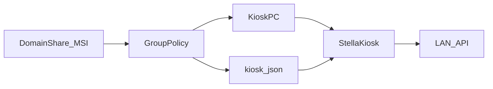

# Распространение Stella Kiosk политиками

Киоск-приложение **не ставится вручную на каждый ПК**. Канал доставки: **Group Policy (GPO)** и/или **MDM**.

## Что раздаётся политикой

| Артефакт | Назначение |
|-----------|------------|
| Пакет **MSI** (предпочтительно) или **MSIX** | Установка / обновление Stella Kiosk |
| **WebView2 Runtime** | Зависимость Tauri на Windows (если ещё нет в образе) |
| Файл **`kiosk.json`** (или скрипт его генерации) | `hostname` / `kioskId` (= имя ПК), `serverUrl`, `healthPort`, интервалы |
| **Health-агент** (вместе с пакетом) | Слушает порт **47821**, отвечает `GET /health` — сервер опрашивает по hostname |
| (опционально) скрипты Assigned Access / автологин | Жёсткий kiosk mode |

Контент экспонатов (фото, видео, тексты) **политиками не раздаётся** — только sync с сервером в LAN.

## Типовой поток GPO



1. Собрать установщик (`tauri build` → MSI/NSIS; для GPO удобнее MSI).
2. Выложить MSI в сетевую папку, доступную компьютерам OU «Киоски».
3. GPO → Computer Configuration → Software Installation → назначить пакет (или Startup Script с `msiexec /i ... /qn`).
4. Отдельным Preference / скриптом положить `kiosk.json` в каталог данных приложения, например:
   - `%ProgramData%\StellaKiosk\kiosk.json`
5. Идентификатор киоска = **доменное имя ПК** (`COMPUTERNAME`), без префикса:

```powershell
$hostName = $env:COMPUTERNAME.ToLower()
@{
  hostname = $hostName
  kioskId = $hostName
  serverUrl = "http://192.168.1.10:8080"
  healthPort = 47821
  syncIntervalSec = 300
  idleTimeoutSec = 60
  heartbeatIntervalSec = 30
  appVersion = "0.1.0"
} | ConvertTo-Json | Set-Content "$env:ProgramData\StellaKiosk\kiosk.json" -Encoding UTF8
```

6. В админке добавить киоск по тому же hostname (например `patriotstela1`) и привязать экспонат. Сервер сам опрашивает `http://<hostname>:47821/health`.
7. Assigned Access + автологин — политикой или один раз в золотом образе (см. [assigned-access.md](assigned-access.md)).
8. На ПК должен быть открыт входящий порт **47821** (firewall GPO) для опроса с сервера.

## Обновление версии

1. Новая сборка MSI с увеличенным `productVersion`.
2. Замена файла в share / публикация в MDM.
3. GPO/MDM обновляет пакет на ПК при следующем цикле.
4. Контент на экране по-прежнему обновляется sync’ом с сервера, без переустановки.

## Silent install (пример)

```bat
msiexec /i StellaKiosk_0.1.0_x64.msi /qn /norestart
```

## Важно для сборки

- Один бинарник на все киоски; различия только в `kiosk.json`.
- Приложение должно читать конфиг из предсказуемого пути (`ProgramData` или рядом с exe) — путь зафиксировать в коде при подготовке MSI.
- Код подписи (code signing) желателен, если политики требуют подписанные пакеты.

## Связанные документы

- [TZ §12.1](TZ-informacionnye-kioski.md)
- [Assigned Access](assigned-access.md)
- [Чеклист приёмки](acceptance-checklist.md)
