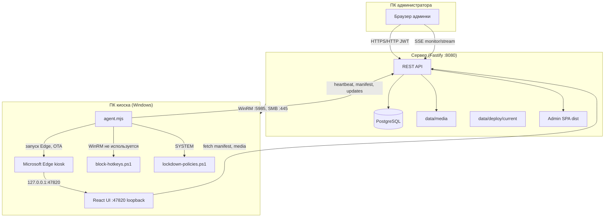

# Stella UDHB — как работает весь софт

Подробное описание архитектуры, потоков данных и эксплуатации информационных киосков Stella.

См. также: [production.md](production.md), [kiosk-remote-install.md](kiosk-remote-install.md), [TZ-informacionnye-kioski.md](TZ-informacionnye-kioski.md).

---

## 1. Назначение системы

Stella UDHB — комплекс для **музейных / выставочных информационных киосков**:

| Компонент | Где работает | Задача |
|-----------|--------------|--------|
| **Сервер (API + БД)** | Windows/Linux сервер в LAN | Хранит экспонаты, медиа, настройки; отдаёт контент киоскам; управляет установкой ПО на ПК зала |
| **Админка (React SPA)** | Браузер → тот же сервер `:8080` | Редактирование контента, мониторинг киосков, удалённая установка/остановка |
| **Киоск (Edge + агент)** | ПК в зале (Windows) | Полноэкранный UI для посетителя; синхронизация контента; блокировка клавиатуры |

Посетитель работает **только касанием**. Клавиатура и системные горячие клавиши могут быть отключены политиками Windows и скриптами Stella.

---

## 2. Общая схема



**Ключевая идея:** сервер — единый источник правды для контента и настроек. На киоске локально лежат только **кэш медиа** (IndexedDB) и **собранный UI** в `C:\ProgramData\StellaKiosk\ui\`.

---

## 3. Структура репозитория

```
stella-udhb/
├── apps/
│   ├── server/          # Fastify API, Prisma, PowerShell-скрипты удалённой установки
│   ├── admin/           # React-админка (Vite)
│   └── kiosk/           # React UI киоска + kiosk-agent.mjs + lockdown-скрипты
├── packages/
│   └── shared/          # Общие TypeScript-типы и подписи статусов
├── scripts/
│   └── pack-kiosk-deploy.ps1   # Сборка пакета для установки на киоски
├── data/
│   ├── media/           # Загруженные файлы (фото, видео, реклама)
│   └── deploy/current/  # Готовый пакет: agent, ui, zips, node.exe
├── docs/                # Документация
└── .env                 # Конфиг сервера (не коммитить секреты)
```

### npm/pnpm-скрипты (корень)

| Команда | Действие |
|---------|----------|
| `pnpm dev:server` | API на `:8080` (dev) |
| `pnpm dev:admin` | Админка на `:5173` (прокси на API) |
| `pnpm dev:kiosk` | UI киоска на `:5174` |
| `pnpm build:prod` | shared → admin → server |
| `pnpm pack:kiosk-deploy` | Сборка `data/deploy/current` |
| `pnpm start:prod` | Production-сервер |
| `pnpm db:migrate` / `db:seed` | Миграции и начальный admin |

---

## 4. Сервер (apps/server)

### 4.1. Технологии

- **Fastify 5** — HTTP API, JWT, multipart (загрузка файлов до 2 GB), static (медиа и admin dist).
- **Prisma + PostgreSQL** — пользователи, экспонаты, киоски, глобальные настройки.
- **PowerShell / OpenSSH** — удалённые операции на **Windows-киосках** с сервера (Debian/Linux или Windows): WinRM через `pwsh` или SSH.

Точка входа: `apps/server/src/index.ts`.

### 4.2. Модели данных (Prisma)

| Модель | Назначение |
|--------|------------|
| `User` | Логин, пароль (bcrypt), роль (`admin` / `editor` / `viewer`) |
| `MediaFile` | Файл на диске + hash для дедупликации и проверки кэша |
| `Exhibit` | Экспонат: текст, ТТХ (JSON), привязка hero/video/audio/gallery |
| `ExhibitGallery` | Связь экспонат ↔ файлы галереи, порядок |
| `GlobalAd` | Глобальная реклама (картинки на всех киосках) |
| `SiteSettings` | `blockKeyboard`, `softwareEnabled`, версии, **сетевые настройки** (URL, порты, CORS, probe) |
| `Kiosk` | hostname, порты, привязка к экспонату, probe/install/sync статусы |

**Версионирование контента:**

- `Exhibit.contentVersion` — меняется при редактировании экспоната.
- `SiteSettings.adsVersion` — при смене рекламы.
- `SiteSettings.settingsVersion` — при смене `blockKeyboard` / `softwareEnabled` / сети.

Киоск получает **отпечаток** `syncFingerprint = contentVersion|adsVersion|settingsVersion` и при изменении качает новый manifest.

### 4.3. API (основные группы)

#### Публичные (без JWT) — для киосков

| Метод | Путь | Назначение |
|-------|------|------------|
| GET | `/api/kiosks/:kioskId/manifest` | Полный manifest: экспонат, файлы, URLs медиа, флаги lockdown |
| GET | `/api/kiosks/:kioskId/updates` | Лёгкий poll: версии + `updateAvailable` для OTA агента |
| POST | `/api/kiosks/:kioskId/heartbeat` | «Я жив», версия контента, sync status |
| GET | `/api/files/:id` | Отдача медиафайла |
| GET | `/api/deploy/meta` | Версия software, ссылки на zip |
| GET | `/api/deploy/update.zip` | OTA-обновление агента/UI |

#### Защищённые (JWT)

| Группа | Примеры |
|--------|---------|
| Auth | `POST /api/auth/login`, `GET /api/auth/me` |
| Users | CRUD (только `admin`) |
| Exhibits / Ads | CRUD контента |
| Settings | `PUT /api/settings`, `PUT /api/settings/network` |
| Kiosks | CRUD, install/start/stop, probe, push-config, clear-policies, rollback-all |
| Monitor | `GET /api/kiosks/monitor/stream` (SSE) |

**Роли:**

- `admin` — всё + пользователи.
- `editor` — редактирование контента, киосков, настроек.
- `viewer` — просмотр, мониторинг, ручной probe (без кнопок изменения).

### 4.4. Мониторинг (SSE)

`GET /api/kiosks/monitor/stream?token=<JWT>`

- Сервер каждые **5 с** рассылает snapshot всех киосков.
- При изменении одного киоска — event `kiosk`.
- Каждые **15 с** — ping-комментарий (keep-alive).

Статусы probe (`ProbeStatus`):

| Статус | Значение |
|--------|----------|
| `unknown` | Ещё не опрашивали |
| `healthy` | Health OK + свежий heartbeat + sync OK |
| `degraded` | Health OK, но нет heartbeat или sync error |
| `no_software` | Нет ответа на `http://hostname:healthPort/health` |
| `unreachable` | DNS/имя хоста не резолвится |

**Online** = heartbeat был менее **2 минут** назад (`ONLINE_THRESHOLD_MS`).

Фоновый probe: интервал из БД/`.env` (`probeIntervalMs`, по умолчанию 30 с).

### 4.5. Удалённые операции на киосках (Debian → Windows)

Сервер Stella может работать на **Debian/Linux**. Киоски — **Windows**. Управление с админки идёт через модуль `remoteDeploy.ts`:

| Транспорт | Когда | На Debian | На киоске |
|-----------|-------|-----------|-----------|
| **WinRM** (`auto`, если есть `pwsh`) | Классический путь | `apt install powershell`, `Install-Module PSWSMan`, `Install-WSMan` | WinRM включён, порт 5985 |
| **SSH** (`DEPLOY_TRANSPORT=ssh` или fallback) | Проще на Debian | `openssh-client`, `sshpass` (для пароля) | **OpenSSH Server** (Windows Optional Feature) |

Нужны `DEPLOY_USER` и `DEPLOY_PASSWORD` (или `DEPLOY_SSH_KEY_PATH`) — учётка администратора **на Windows-киоске** (UPN: `user@domain.local`).

| Операция | TS-модуль | WinRM | SSH (Debian) |
|----------|-----------|-------|--------------|
| Установка | `remoteInstall.ts` | `remote-install.ps1` | `remote-install-ssh.sh` |
| Запуск | `remoteStart.ts` | `remote-start.ps1` | `remote-start-ssh.sh` |
| Остановка | `remoteStop.ts` | `remote-stop.ps1` | `remote-stop-ssh.sh` |
| Удаление с ПК | `remoteUninstall.ts` | `remote-uninstall.ps1` | `remote-uninstall-ssh.sh` |
| Push kiosk.json | `remotePushConfig.ts` | `remote-push-config.ps1` | `remote-push-config-ssh.sh` |
| Снять политики | `remoteClearPolicies.ts` | `remote-clear-policies.ps1` | `remote-clear-policies-ssh.sh` |

**Установка (кратко):**

1. Admin нажимает «Установить» → `installStatus=queued`.
2. Сервер запускает `remote-install.ps1` с hostname, ServerUrl, портами из БД.
3. Скрипт копирует `package.zip` на `C:\ProgramData\StellaKiosk` (SMB `\\host\C$` или WinRM).
4. Пишет `kiosk.json`, запускает `install-local.ps1`.
5. Создаёт задачи Windows, запускает агент и Edge.
6. Статусы этапов (`STAGE:connecting`, `copying`, …) пишутся в БД для UI админки.

**Откат всех (`POST /api/kiosks/rollback-all`):**

- На каждом киоске — полный uninstall + снятие политик.
- В БД: `softwareEnabled=true`, `blockKeyboard=false`.
- Записи киосков можно оставить или удалить (второй confirm).

---

## 5. Админка (apps/admin)

React SPA, маршруты в `App.tsx`:

| URL | Страница |
|-----|----------|
| `/` | Мониторинг (SSE, карточки киосков) |
| `/exhibits` | Экспонаты |
| `/ads` | Глобальная реклама |
| `/kiosks` | Парк ПК: установка, порты, start/stop, откат |
| `/settings` | Софт вкл/выкл, клавиатура, **сеть и порты** |
| `/users` | Пользователи (admin) |

**Production:** собранный `apps/admin/dist` раздаётся сервером с `/` (тот же порт **8080**).

**Dev:** Vite `:5173`, API проксируется на `:8080`.

---

## 6. Киоск на ПК зала

### 6.1. Файловая структура после установки

```
C:\ProgramData\StellaKiosk\
├── agent.mjs              # Node-агент (из kiosk-agent.mjs)
├── kiosk.json             # Конфиг: serverUrl, порты, kioskId
├── ui\                    # Собранный React (статика)
├── runtime\node.exe       # Portable Node (из пакета)
├── edge-profile\          # Профиль Edge (сохраняет offline/cache)
├── block-hotkeys.ps1
├── lockdown-policies.ps1
├── clear-policies.ps1
├── install-local.ps1
├── BLOCK_KEYBOARD         # Флаг "1" = блокировать
├── STOPPED                # Admin Stop — не поднимать UI
├── SOFTWARE_DISABLED      # Глобальное выкл. софта
├── powercfg-backup.txt    # Бэкап таймаутов питания до kiosk-режима
└── version.json / VERSION # Версия software для OTA
```

### 6.2. Агент (`kiosk-agent.mjs`)

Два HTTP-сервера в одном процессе Node:

| Порт | Bind | Назначение |
|------|------|------------|
| **uiPort** (47820) | `127.0.0.1` | Статика UI + live `/kiosk.json` |
| **healthPort** (47821) | `0.0.0.0` | `GET /health`, `POST /status` (для probe сервера) |

**Циклы агента:**

1. **Heartbeat** → `POST /api/kiosks/:id/heartbeat` (каждые ~30 с).
2. **Poll updates** → `GET /api/kiosks/:id/updates` — проверка fingerprint и OTA.
3. **Edge watchdog** — если нет Edge на `127.0.0.1:uiPort`, перезапуск через scheduled task.
4. **Применение настроек** с сервера:
   - `softwareEnabled=false` → флаг `SOFTWARE_DISABLED`, kill Edge, снять lockdown.
   - `blockKeyboard` → файл `BLOCK_KEYBOARD`, `lockdown-policies.ps1`, задача KeyBlock.

**OTA:** при новой `softwareVersion` скачивает `update.zip`, распаковывает поверх `StellaKiosk`, перезапускает себя.

### 6.3. UI киоска (React)

`apps/kiosk/src/`:

- Загрузка конфига: `GET /kiosk.json` (от агента, не захардкожен).
- **sync.ts** — manifest в `localStorage`, медиа в **IndexedDB**, fingerprint для инкрементальной синхронизации.
- **lockdown.ts** — в браузере блокирует события клавиатуры (дополнение к OS-level block).
- Режимы: главная, о экспонате, галерея, видео; глобальная реклама; idle timeout → заставка.

**Offline:** если сервер недоступен, но кэш полный — UI показывает локальные blob-URL из IndexedDB.

### 6.4. Microsoft Edge

Запускается в режиме **kiosk fullscreen**:

```
msedge.exe --user-data-dir="...\edge-profile" --kiosk http://127.0.0.1:47820/ ...
```

Профиль **persistent** — после перезагрузки offline-кэш и session сохраняются.

---

## 7. Windows: задачи и lockdown

### 7.1. Scheduled Tasks (`install-local.ps1`)

| Задача | Учётная запись | Триггер | Действие |
|--------|----------------|---------|----------|
| `StellaKioskAgent` | SYSTEM | At startup (+20 s) | `node.exe agent.mjs` |
| `StellaKioskUI` | Пользователь консоли | At logon | Edge → UI |
| `StellaKioskKeyBlock` | Пользователь консоли | At logon | `block-hotkeys.ps1` |
| `StellaKioskStartNow` | one-shot | — | Немедленный запуск Edge |
| `StellaKioskKeyBlockNow` | one-shot | — | Немедленный keyblock |

**Admin Stop** (`remote-stop.ps1`):

- Создаёт `STOPPED`, убивает процессы.
- Задачи **остаются Enabled** — после reboot агент снова стартует, но увидит `STOPPED` и не откроет Edge (пока admin не нажмёт Start).

**Глобальное выкл. софта** (`softwareEnabled=false`):

- Флаг `SOFTWARE_DISABLED` — переживает reboot.
- Агент не поднимает UI, снимает lockdown.

### 7.2. Уровни блокировки клавиатуры

| Уровень | Компонент | Что делает |
|---------|-----------|------------|
| 1 | `lockdown.ts` (браузер) | preventDefault на keydown |
| 2 | `block-hotkeys.ps1` | WH_KEYBOARD_LL — глотает все клавиши; `DisableTaskMgr` |
| 3 | `lockdown-policies.ps1` | Registry: NoClose, NoLogoff, DisableLockWorkstation… |
| 4 | Windows Keyboard Filter (WEKF) | Ctrl+Alt+Del, Win+Tab, Alt+Tab… (Enterprise/Education/IoT) |

**Важно:** LL-хуки **не могут** перехватить Ctrl+Alt+Del (Secure Attention Sequence) — для этого нужен WEKF + часто **одна перезагрузка** после первого включения.

### 7.3. Снятие политик (`clear-policies.ps1`)

Вызывается при:

- Uninstall / rollback-all.
- Кнопка «Снять политики» в админке.
- Inline-fallback, если скрипта нет в старом пакете.

**Снимает:**

- Registry HKLM/HKCU (System + Explorer).
- WEKF predefined keys.
- Останавливает службы Keyboard Filter → Manual.
- Удаляет `BLOCK_KEYBOARD`, `NEED_REBOOT_KEYFILTER`.
- Восстанавливает **powercfg** из `powercfg-backup.txt` или дефолт (монитор 15 мин).

После снятия иногда нужен **logoff/reboot**, чтобы Explorer обновил меню Пуск.

---

## 8. Сеть и порты

### 8.1. Таблица портов

| Сервис | Порт | Где | Примечание |
|--------|------|-----|------------|
| API + Admin | **8080** | Сервер | `PORT` в `.env` |
| Kiosk UI | **47820** | localhost киоска | Только loopback |
| Kiosk health | **47821** | киоск (LAN) | Probe с сервера |
| WinRM | **5985** | Windows-киоск | Remote install (pwsh с Debian) |
| SSH | **22** | Windows-киоск | Remote install (DEPLOY_TRANSPORT=ssh) |
| SMB | **445** | Windows-киоск | Копирование package.zip (WinRM-путь) |
| Admin dev | 5173 | dev only | |
| Kiosk dev | 5174 | dev only | |

### 8.2. Откуда берутся настройки

| Параметр | БД (SiteSettings / Kiosk) | .env fallback |
|----------|----------------------------|---------------|
| `serverPublicUrl` | да | `SERVER_PUBLIC_URL` |
| defaultHealthPort / defaultUiPort | да | 47821 / 47820 |
| corsOrigins | да | `CORS_ORIGIN` |
| probeIntervalMs / probeTimeoutMs | да | `PROBE_*` |
| Per-kiosk serverUrl, ports | Kiosk row | наследует site default |
| PORT, HOST | — | только `.env` (нужен restart) |

**CORS:** loopback (`127.0.0.1`, `localhost`) **всегда** разрешён — UI киоска ходит на API по LAN URL из `kiosk.json`.

---

## 9. Потоки данных (пошагово)

### 9.1. Первичная установка киоска

```
Admin: «Добавить киоск» + hostname
  → POST /api/kiosks (опционально installSoftware)
  → remote-install.ps1
      → copy package → C:\ProgramData\StellaKiosk
      → kiosk.json (serverUrl, ports, kioskId)
      → install-local.ps1 (tasks, Edge, lockdown)
  → installStatus=ok
```

### 9.2. Синхронизация контента

```
UI (Edge) → GET /api/kiosks/:id/manifest
  → сравнение fingerprint
  → download /api/files/:id → IndexedDB
  → heartbeat syncStatus=ok
```

При изменении экспоната в админке `contentVersion` ↑ → киоск на следующем poll/manifest sync качает diff.

### 9.3. Изменение «Отключить клавиатуру»

```
Admin Settings → PUT /api/settings (blockKeyboard)
  → settingsVersion++
  → kiosk poll /updates → blockKeyboard новый
  → agent: BLOCK_KEYBOARD, lockdown-policies, KeyBlock task
```

### 9.4. Push конфига после смены портов в админке

```
Admin: «Сохранить порты» → PATCH /api/kiosks/:id
Admin: «Применить на ПК» → POST .../push-config
  → remote-push-config.ps1
  → перезапись kiosk.json + restart StellaKioskAgent task
```

---

## 10. Сборка пакета для киосков

```powershell
pnpm pack:kiosk-deploy
```

Скрипт `scripts/pack-kiosk-deploy.ps1`:

1. `pnpm --filter @stella/kiosk build` → UI в `data/deploy/current/ui/`.
2. Копирует `agent.mjs`, lockdown-скрипты, `install-local.ps1`.
3. Подтягивает portable Node в `runtime/` (если есть в `tools/node`).
4. Пишет `version.json`, `package.zip`, `update.zip`, `MANIFEST.txt`.

Без этого шага кнопка «Установить» в админке покажет «пакет не готов».

---

## 11. Production-запуск сервера

```powershell
pnpm build:prod
pnpm db:migrate
pnpm start:prod
```

`start:prod` → `node --import set-prod-env.mjs dist/index.js`:

- Принудительно `NODE_ENV=production`.
- Требует сильный `JWT_SECRET` и `DATABASE_URL`.
- Раздаёт admin из `apps/admin/dist` на том же порту, что API.

Подробнее: [production.md](production.md).

---

## 12. Типичные проблемы

| Симптом | Возможная причина | Действие |
|---------|-------------------|----------|
| Probe `no_software` | Агент не запущен / firewall 47821 | Start, проверить задачу StellaKioskAgent |
| Probe `degraded` | Нет heartbeat (сеть, serverUrl) | Проверить `kiosk.json`, SERVER_PUBLIC_URL |
| Урезанное меню Windows после uninstall | Политики не сняты | «Снять политики» или rollback; reboot |
| Ctrl+Alt+Del всё ещё работает | Pro без WEKF / нужен reboot | Enterprise/Education; reboot после install |
| Offline пустой экран после reboot | Edge без persistent profile | Обновить пакет (edge-profile в install) |
| Install WinRM fail | Cred / firewall 5985 | DEPLOY_USER@domain, WinRM включён на киоске |
| CORS в admin после смены origins | CORS из БД после restart | Перезапустить `start:prod` |

---

## 13. Индекс ключевых файлов

```
apps/server/src/index.ts              — bootstrap сервера
apps/server/src/config.ts             — .env
apps/server/src/routes/kiosks.ts      — киоски, manifest, SSE
apps/server/src/routes/settings.ts    — настройки + network API
apps/server/src/kioskProbe.ts         — health probe
apps/server/src/networkSettings.ts    — порты, kiosk.json builder
apps/server/src/remoteInstall.ts      — очередь установки
apps/server/prisma/schema.prisma      — схема БД

apps/server/scripts/remote-install.ps1
apps/server/scripts/install-local.ps1
apps/server/scripts/remote-uninstall.ps1
apps/server/scripts/remote-clear-policies.ps1

apps/kiosk/scripts/kiosk-agent.mjs
apps/kiosk/scripts/block-hotkeys.ps1
apps/kiosk/scripts/lockdown-policies.ps1
apps/kiosk/scripts/clear-policies.ps1
apps/kiosk/src/sync.ts

apps/admin/src/pages/KiosksPage.tsx
apps/admin/src/pages/SettingsPage.tsx
apps/admin/src/pages/MonitoringPage.tsx

packages/shared/src/index.ts          — DTO, подписи статусов
scripts/pack-kiosk-deploy.ps1
.env.example
```

---

*Документ актуален для ветки с network settings, clear-policies, rollback-all и push-config (август 2026).*
